# User Service Documentation

## Auth Strategy

**JWT RS256 + Redis JTI Whitelist + Refresh Rotation**

- **Access token**: RS256, 15-minute TTL. Verified via `auth_required` middleware.
- **Refresh token**: RS256, 7-day TTL. Stored in Redis whitelist (`jti:*` keys).
- **Rotation**: Each `/auth/refresh` call issues a new pair and revokes the old refresh JTI atomically (Redis `ROTATE_PAIR` operation). Replay attack: old refresh token is rejected with 401.
- **Lockout**: 5 consecutive login failures → account locked for 15 min.
- **Suspend**: Admin suspend calls `RevokeAll` on Redis — all active JTIs for that user are removed. Subsequent auth checks fail immediately.
- **Keys**: RSA private/public PEM — configured via `jwt.private_key_path` + `jwt.public_key_path` in `config/config.yaml`. Integration tests generate a fresh keypair on each run.

---

## Endpoint Catalog

### Auth (public)

| Method | Path | Description | Body |
|--------|------|-------------|------|
| POST | `/api/v1/auth/register` | Register + send OTP | `{email, password, full_name}` |
| POST | `/api/v1/auth/verify-register` | Verify OTP → activate → token pair | `{destination, code}` |
| POST | `/api/v1/auth/login` | Login → token pair | `{identifier, password}` |
| POST | `/api/v1/auth/refresh` | Rotate token pair | `{refresh_token}` |
| POST | `/api/v1/auth/logout` | Revoke tokens | `{access_token, refresh_token}` |
| POST | `/api/v1/auth/change-password` | Change own password | `{old_password, new_password}` |
| POST | `/api/v1/auth/forgot-password` | Send reset link | `{identifier}` |
| POST | `/api/v1/auth/reset-password` | Reset with token | `{token, new_password}` |

### Profile (authenticated)

| Method | Path | Permission | Description |
|--------|------|-----------|-------------|
| GET | `/api/v1/me` | — | Full profile bundle |
| PATCH | `/api/v1/me` | — | Update own user fields |
| PATCH | `/api/v1/me/student-profile` | — | Update student profile |
| PATCH | `/api/v1/me/faculty-profile` | — | Update faculty profile |

### Vendor (authenticated)

| Method | Path | Permission | Description |
|--------|------|-----------|-------------|
| POST | `/api/v1/vendors/onboard` | — | Submit vendor onboarding request |
| GET | `/api/v1/me/vendors` | — | List my vendor memberships |
| GET | `/api/v1/vendors/:id/staff` | `vendor_member.list` (vendor) | List vendor staff |
| DELETE | `/api/v1/vendors/:id/staff/:user_id` | `vendor_member.remove` (vendor) | Remove staff |
| GET/POST | `/api/v1/vendors/:id/invitations` | `vendor_member.invite` (vendor) | Send invitation |
| POST | `/api/v1/invitations/accept` | — | Accept invitation by token |

### RBAC (authenticated)

| Method | Path | Permission | Description |
|--------|------|-----------|-------------|
| GET | `/api/v1/roles` | `role.read` | List roles |
| POST | `/api/v1/roles` | `role.create` | Create role |
| GET | `/api/v1/roles/:id` | `role.read` | Get role |
| PATCH | `/api/v1/roles/:id` | `role.update` | Update role |
| DELETE | `/api/v1/roles/:id` | `role.delete` | Delete non-system role |
| GET | `/api/v1/roles/:id/permissions` | `role.read` | List role permissions |
| POST | `/api/v1/roles/:id/permissions/:perm_id` | `role.assign_permission` | Assign permission |
| DELETE | `/api/v1/roles/:id/permissions/:perm_id` | `role.assign_permission` | Revoke permission |
| GET | `/api/v1/permissions` | `permission.read` | List permissions |
| POST | `/api/v1/permissions` | `permission.create` | Create permission |

### Admin (authenticated)

| Method | Path | Permission | Description |
|--------|------|-----------|-------------|
| GET | `/api/v1/admin/users` | `user.read` | List users |
| POST | `/api/v1/admin/users/:id/suspend` | `user.suspend` | Suspend user |
| POST | `/api/v1/admin/users/:id/reactivate` | `user.suspend` | Reactivate user |
| POST | `/api/v1/admin/users/:id/roles` | `user.assign_role` | Assign role |
| DELETE | `/api/v1/admin/users/:id/roles/:role_id` | `user.assign_role` | Remove role |
| PATCH | `/api/v1/admin/users/:id/student-profile` | `user.update` | Update student profile |
| PATCH | `/api/v1/admin/users/:id/faculty-profile` | `user.update` | Update faculty profile |
| POST | `/api/v1/admin/users/:id/cards` | `user.update` | Bind card |
| DELETE | `/api/v1/admin/users/:id/cards/:card_id` | `user.update` | Revoke card |
| GET | `/api/v1/admin/users/:id/cards` | `user.read` | List cards |
| POST | `/api/v1/admin/vendors/:id/approve` | `vendor.approve` | Approve vendor |
| POST | `/api/v1/admin/vendors/:id/reject` | `vendor.reject` | Reject vendor |

### gRPC

| Method | Description |
|--------|-------------|
| `UserService.GetUser` | Lookup user by ID (for inter-service calls) |
| `UserService.GetUsers` | Batch lookup |
| `UserService.GetVendorMembership` | Get membership by user+vendor |

---

## Event Catalog (Outbox)

| event_type | Trigger | Payload fields |
|------------|---------|----------------|
| `vendor.requested` | Vendor onboard submitted | vendor_id, vendor_name, business_type, address, phone, owner_user_id |
| `vendor.approved` | Admin approves vendor | vendor_id, admin_id |
| `vendor.rejected` | Admin rejects vendor | vendor_id, admin_id, reason |
| `vendor.member.joined` | Invitation accepted | vendor_id, user_id, role |
| `vendor.member.left` | Staff removed | vendor_id, user_id, role |
| `user.suspended` | Admin suspends user | user_id, reason |
| `user.activated` | Admin reactivates user | user_id |

---

## Audit Log Actions

All actions are inserted into `audit_logs` table (append-only, no DELETE from app layer).

| Action | Trigger | In TX? |
|--------|---------|--------|
| `auth.register` | User registration | No |
| `auth.login_success` | Successful login | No |
| `auth.login_failed` | Wrong password | No |
| `auth.account_locked` | 5 consecutive failures | No |
| `auth.logout` | Logout | No |
| `auth.password_changed` | Password change | No |
| `auth.password_reset` | Password reset completion | No |
| `vendor.onboarded` | Vendor onboard submitted | No |
| `vendor.approved` | Vendor approved | Yes |
| `vendor.rejected` | Vendor rejected | Yes |
| `vendor.invite_sent` | Invitation created | No |
| `vendor.invite_accepted` | Invitation accepted | Yes |
| `vendor.staff_removed` | Staff removed | Yes |
| `user.suspended` | User suspended | Yes |
| `user.activated` | User reactivated | Yes |
| `user.role_assigned` | Role assigned | No |
| `user.role_removed` | Role removed | No |
| `admin.profile_updated` | Admin updates profile | No |
| `card.bound` | Card bound | No |
| `card.revoked` | Card revoked | No |

**Security**: payload JSONB never contains `password`, `password_hash`, `token`, `code`, `secret`, `otp` — stripped by `audit.redactSensitive` before insert.

---

## RBAC Model

Dynamic role-based access control with scope support:

- **Roles** (`roles`): named sets of permissions. `is_system=true` roles cannot be deleted.
- **Permissions** (`permissions`): fine-grained codes like `user.suspend`, `role.create`.
- **User Roles** (`user_roles`): M-M with scope (`global` | `vendor`). Scoped roles only grant permissions within their vendor context.
- **Permission cache**: Redis key `rbac:user:{uid}:perms` (global), `rbac:user:{uid}:vendor:{vid}:perms` (vendor-scoped). TTL 5 minutes. Invalidated on role/permission change.

Seeded system roles: `SUPER_ADMIN`, `SCHOOL_ADMIN`, `VENDOR_OWNER`, `VENDOR_STAFF_KITCHEN`, `VENDOR_STAFF_CASHIER`.

---

## ERD (Mermaid)

```mermaid
erDiagram
    users {
        uuid id PK
        varchar email
        varchar phone
        text password_hash
        varchar status
        varchar full_name
        date dob
        varchar gender
        text avatar_url
        int failed_login_attempts
        timestamptz locked_until
        timestamptz created_at
        timestamptz updated_at
    }

    student_profiles {
        uuid id PK
        uuid user_id FK
        varchar student_code
        varchar faculty
        varchar class
        int cohort_year
        varchar dormitory_room
        jsonb allergies
    }

    faculty_profiles {
        uuid id PK
        uuid user_id FK
        varchar staff_code
        varchar department
        varchar position
        bool allow_payroll_deduction
    }

    roles {
        uuid id PK
        varchar code
        varchar name
        text description
        varchar scope_type
        bool is_system
    }

    permissions {
        uuid id PK
        varchar code
        varchar resource
        varchar action
        bool is_system
    }

    role_permissions {
        uuid role_id FK
        uuid permission_id FK
        uuid granted_by FK
    }

    user_roles {
        uuid id PK
        uuid user_id FK
        uuid role_id FK
        varchar scope_type
        uuid scope_id
        uuid granted_by FK
        timestamptz expires_at
        timestamptz granted_at
    }

    vendor_memberships {
        uuid id PK
        uuid user_id FK
        varchar vendor_id
        varchar role_in_vendor
        varchar status
        uuid invited_by FK
        timestamptz invited_at
        timestamptz joined_at
    }

    invitations {
        uuid id PK
        varchar vendor_id
        varchar email
        varchar role_in_vendor
        varchar token_hash
        varchar status
        uuid accepted_by_user_id FK
        timestamptz expires_at
        timestamptz accepted_at
    }

    otp_codes {
        uuid id PK
        uuid user_id FK
        varchar purpose
        varchar destination
        text code_hash
        int attempts
        timestamptz expires_at
        timestamptz used_at
    }

    password_reset_tokens {
        uuid id PK
        uuid user_id FK
        varchar token_hash
        timestamptz expires_at
        timestamptz used_at
    }

    card_identifiers {
        uuid id PK
        uuid user_id FK
        varchar kind
        varchar identifier
        timestamptz revoked_at
    }

    outbox_events {
        uuid id PK
        varchar aggregate_type
        varchar aggregate_id
        varchar event_type
        jsonb payload
        varchar status
        int attempts
        text last_error
        timestamptz published_at
        timestamptz created_at
    }

    audit_logs {
        uuid id PK
        uuid actor_user_id FK
        varchar action
        varchar target_type
        uuid target_id
        varchar ip
        text user_agent
        varchar trace_id
        jsonb payload
        timestamptz created_at
    }

    users ||--o{ student_profiles : "has"
    users ||--o{ faculty_profiles : "has"
    users ||--o{ user_roles : "assigned"
    users ||--o{ vendor_memberships : "member of"
    users ||--o{ card_identifiers : "owns"
    users ||--o{ otp_codes : "requests"
    users ||--o{ password_reset_tokens : "requests"
    roles ||--o{ role_permissions : "has"
    permissions ||--o{ role_permissions : "included in"
    roles ||--o{ user_roles : "granted via"
    users ||--o{ audit_logs : "actor"
```

